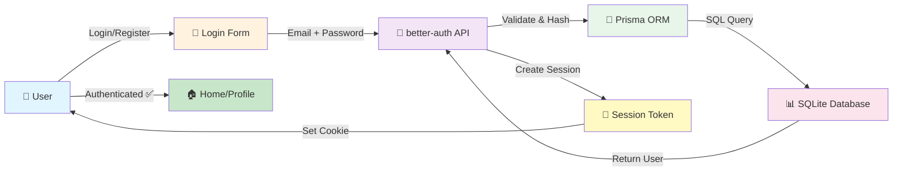

<div align="center">

# 🔐 Basic Auth Profile

### ✨ A Modern, Frosted-Glass Authentication & Profile Management System

[](https://github.com/yourusername/basic-auth-profile/stargazers)
[](https://github.com/yourusername/basic-auth-profile/watchers)
[](https://github.com/yourusername/basic-auth-profile/network/members)
[](LICENSE)
[](https://nextjs.org)

_Why did the authentication system go to therapy? It had too many unresolved sessions! 😄_

</div>

---

## 🌟 About This Project

**Basic Auth Profile** is a beautifully crafted, production-ready authentication system built with cutting-edge technologies. Perfect for developers who want a **clean, easy-to-understand** starter kit without the bloat!

> **"It's like a frosted glass window – you can see through it, but it looks amazing!"** 🎨

---

## 🎯 Quick Overview

```
┌─────────────────────────────────────┐
│   🌐 Next.js Frontend              │
│  ✨ React 19 + Tailwind CSS        │
└──────────────┬──────────────────────┘
               │
               │
┌──────────────▼──────────────────────┐
│  🔑 Better Auth                     │
│  Session Management & OAuth         │
└──────────────┬──────────────────────┘
               │
               │
┌──────────────▼──────────────────────┐
│  💾 Prisma ORM                      │
│  SQLite Database                    │
└─────────────────────────────────────┘
```

---

## ✨ Features at a Glance

| Feature                     | Status | Description                          |
| --------------------------- | ------ | ------------------------------------ |
| 🔐 **User Authentication**  | ✅     | Email/password login & registration  |
| 👤 **User Profiles**        | ✅     | Beautiful profile cards with avatars |
| 🌓 **Dark/Light Mode**      | ✅     | Glassmorphism theme toggle           |
| 🎨 **Modern UI Components** | ✅     | Pre-built shadcn/ui components       |
| ✔️ **Form Validation**      | ✅     | React Hook Form + Zod schemas        |
| 🔔 **Toast Notifications**  | ✅     | User-friendly feedback               |
| 📱 **Responsive Design**    | ✅     | Works on all devices                 |
| ⚡ **React Compiler**       | ✅     | Auto-optimized rendering             |
| 🌐 **Type-Safe Routing**    | ✅     | Next.js typed routes                 |

---

## 🚀 Tech Stack

```
Frontend              Backend              Database
┌──────────────┐    ┌──────────────┐    ┌──────────────┐
│  React 19    │    │  better-auth │    │   SQLite     │
│  Next.js 16  │───▶│  Prisma ORM  │───▶│  LibSQL      │
│  Tailwind    │    │  Node.js     │    └──────────────┘
│  TypeScript  │    └──────────────┘
└──────────────┘
```

### 📦 Key Dependencies

- **Next.js 16.2.1** – React framework with built-in routing
- **better-auth v1.5.6** – Modern authentication library
- **Prisma 7.5.0** – Type-safe database ORM
- **Tailwind CSS** – Utility-first CSS framework
- **React Hook Form** – Efficient form state management
- **Zod** – TypeScript-first schema validation
- **lucide-react** – Beautiful SVG icons
- **react-toastify** – Toast notifications
- **next-themes** – Dark mode support

---

## 🎮 Quick Start Guide

### Prerequisites

```bash
# You'll need:
- Node.js 18+ (bun or npm)
- Git
- A sense of humor 😄
```

### Installation

**Step 1:** Clone the repository

```bash
git clone https://github.com/yourusername/basic-auth-profile.git
cd basic-auth-profile
```

**Step 2:** Install dependencies

```bash
bun install or bun i
# or: npm install
```

**Step 3:** Set up environment variables

```bash
cp .env.example .env.local
# Edit .env.local with your settings
```

**Step 4:** Initialize the database

```bash
bun run migrate
# This creates tables and generates Prisma types
```

**Step 5:** Start the development server

```bash
bun run dev
# App runs at http://localhost:3000
```

✨ **And you're done!** Welcome to the auth club! 🎉

---

## 📖 Project Structure

```
📦 basic-auth-profile
├── 📂 src/
│   ├── 📂 app/                    # Next.js app directory
│   │   ├── page.tsx               # Home page (profile gallery)
│   │   ├── layout.tsx             # Root layout
│   │   ├── globals.css            # Global styles
│   │   └── 📂 api/
│   │       └── auth/[...all]/     # Auth API route (better-auth)
│   │
│   ├── 📂 components/             # Reusable React components
│   │   ├── UserProfileCard.tsx    # Profile display card
│   │   ├── 📂 Form/
│   │   │   ├── LoginForm.tsx      # Login form component
│   │   │   └── RegisterForm.tsx   # Registration form
│   │   ├── 📂 Buttons/
│   │   ├── 📂 Header/
│   │   ├── 📂 Providers/
│   │   └── 📂 shadcnui/           # Reusable UI components
│   │
│   ├── 📂 lib/                    # Utility functions & configs
│   │   ├── auth.ts                # Server-side auth setup
│   │   ├── auth-client.ts         # Client-side auth hook
│   │   ├── zodSchema.ts           # Validation schemas
│   │   └── 📂 database/
│   │       └── dbClient.ts        # Prisma client
│   │
│   └── 📂 hooks/                  # Custom React hooks
│
├── 📂 prisma/
│   ├── schema.prisma              # Database schema
│   └── 📂 migrations/             # Database migrations
│
├── 📂 public/                     # Static assets
├── 📂 generated/                  # Auto-generated Prisma types
│
├── next.config.ts                 # Next.js configuration
├── tailwind.config.ts             # Tailwind styling config
├── tsconfig.json                  # TypeScript config
├── package.json                   # Dependencies
└── README.md                       # This file! 📖
```

---

## 🔐 Authentication Flow



---

## 🎨 The Glassmorphism Magic

This project features a sleek **Glassmorphism design theme** which means:

✨ **Frosted Glass Effect** – Semi-transparent elements with backdrop blur  
🌈 **Soft Colors** – Gentle gradients and muted tones  
⚫ **Dark & Light Modes** – Seamlessly switch themes  
📱 **Smooth Animations** – Elegant transitions throughout

Toggle the theme using the theme button in the header! 🌓

---

## 📝 Common Tasks

### Add a New Route

```bash
# Create a new file in src/app/
# Example: src/app/dashboard/page.tsx
```

### Modify Database Schema

```bash
# 1. Edit prisma/schema.prisma
# 2. Run migration
bun run migrate
# 3. Use updated types in your code
```

### Create a New Component

```bash
# All components are in src/components/
# Import shadcn/ui components from shadcnui/ folder
```

### Custom Form Validation

```typescript
// Edit src/lib/zodSchema.ts
export const mySchema = z.object({
  email: z.string().email("Invalid email"),
  // ... your fields
});
```

---

## 🎯 Learning Path

### Beginner? Start Here!

1. 📖 Read this README
2. 🏃 Run `bun run dev` and explore the app
3. 👀 Check out `src/components/Form/LoginForm.tsx`
4. 🔍 Look at `src/lib/zodSchema.ts` for validation examples

### Intermediate Developers

1. 🗄️ Modify `prisma/schema.prisma` to add new fields
2. 📋 Create custom forms using React Hook Form
3. 🎨 Customize Tailwind classes in components
4. 🔌 Explore the Auth API at `src/app/api/auth/[...all]/route.ts`

### Advanced Users

1. 🔑 Integrate OAuth providers via better-auth config
2. 💾 Add custom Prisma queries
3. 🚀 Deploy to production with environment setup
4. 🧠 Understand session management & security best practices

---

## 🐛 Troubleshooting

### "Module not found" errors?

```bash
# Regenerate Prisma types
bun run migrate
```

### Database locked?

```bash
# Reset the database (⚠️ deletes all data!)
bun run prisma migrate reset
```

### Port 3000 already in use?

```bash
bun run dev -- -p 3001  # Use port 3001
```

### Theme not persisting?

Check that `localStorage` is available in your browser. Clear cache and retry!

---

## 😄 Funny Facts

| Joke                                                                                                                              | 😂         |
| --------------------------------------------------------------------------------------------------------------------------------- | ---------- |
| _"Why do programmers prefer dark mode? Because light attracts bugs!"_ 🦟                                                          | ⭐⭐⭐     |
| _"This auth system is so good, even your passwords are confused! Where did they go?!"_ 🔐❓                                       | ⭐⭐⭐⭐   |
| _"Debugging authentication is like therapy – lots of sessions and unresolved issues!"_ 🛋️                                         | ⭐⭐⭐⭐⭐ |
| _"Our code is so clean, Marie Kondo would be proud... sparks joy? ✨"_                                                            | ⭐⭐       |
| _"Remember: 'There are only two hard things in Computer Science: cache invalidation and naming things' – and we nailed both!"_ 🎯 | ⭐⭐⭐     |

---

## 📚 Useful Resources

- 📖 [Next.js Documentation](https://nextjs.org/docs)
- 🔐 [Better Auth Docs](https://www.better-auth.com)
- 📊 [Prisma Docs](https://www.prisma.io/docs)
- 🎨 [Tailwind CSS](https://tailwindcss.com)
- 🪝 [React Hook Form](https://react-hook-form.com)
- ✔️ [Zod Validation](https://zod.dev)

---

## 🤝 Contributing

Found a bug? 🐛 Made an improvement? 💡

We'd love to see your contributions!

```bash
# 1. Fork the repository
# 2. Create a branch: git checkout -b feature/your-feature
# 3. Commit changes: git commit -m "Add your feature"
# 4. Push: git push origin feature/your-feature
# 5. Open a Pull Request
```

---

## 📄 License

This project is licensed under the **MIT License** – feel free to use it however you like! 📜

---

## 🙏 Show Some Love

If you found this project helpful, please give it a ⭐ on GitHub!

_Your stars keep our code running and our developers caffeinated!_ ☕✨

---

<div align="center">

### Made with ❤️ & ☕ by developers, for developers

**Happy Coding!** 🚀

</div>
